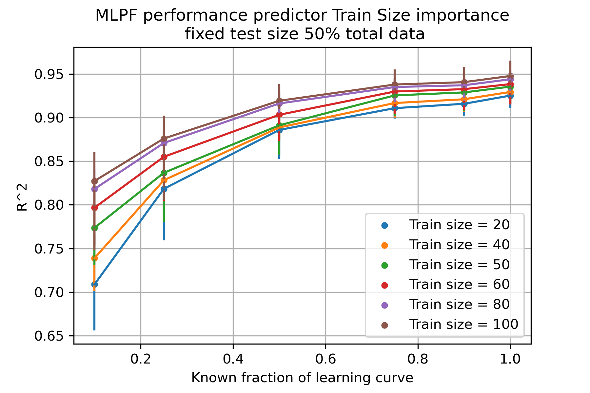
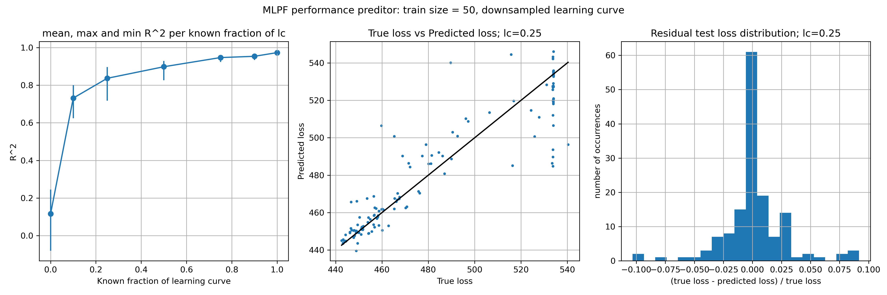

# Performance Predictors for MLPF hyperparameter optimization

This project aims to asses the potential of using performance prediction techniques based on https://arxiv.org/abs/1705.10823 whit the goal of optimizing the hyperparameters of Machine Learning Particle Flow (MLPF) https://github.com/jpata/particleflow .

## Practical Info
* code/SVR_training.ipynb can be used to train and store a performance predictor to be used later on later optimization scripts as both code/distributed_search.py andc ode/optimize.py need to load pretrained scalers and a regressor.
* code/generate_data.py can be used to generate a CSV file of learning curves for a given model. To use a model other than the default one edit code/prial.py.
* The plots stored in results/ can be generated with the notebook code/plots.ipynb.

## Some plots

  
   
   

  

## Licensing
"The code in this project is licensed under Apache License 2.0 license."