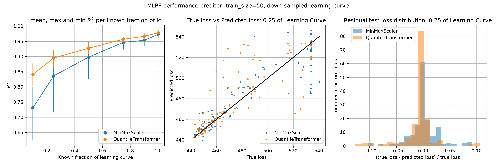

# Performance Predictors for MLPF hyperparameter optimization
> Predicting the performance of a Graph Neural Network for Particle-Flow reconstruction using (Quantum-)SVR

This project aims to asses the potential of using performance prediction techniques based on https://arxiv.org/abs/1705.10823 whit the goal of optimizing the hyperparameters of [Machine Learning Particle Flow (MLPF)](https://github.com/jpata/particleflow) .

## Practical Info
* Use `code/QSVR_experiment.ipynb` to run a QSVR on multiple train/test splits and/or analize the results of this experiments. Saved results that can be analized without using quantum resources can be found in `results/good_qsvr/chain_str_10`.
* Use `code/QSVR_combination.ipynb` to train and/or evaluate the combination technique that allows to use more training points on a QSVR. Saved results that can be analized without using quantum resources can be found in `results/good_qsvr/combination`.
* Use `code/saved_QSVR_true_vs_predicted_loss.ipynb` to load a saved pre-trained QSVR and plot its predicted loss vs true loss for all the reconstruction techines. Some pre-trained QSVRs can be found in `results/good_qsvr/chain_str_10`.
* code/SVR_training.ipynb can be used to train and store a performance predictor to be used later on later optimization scripts as both code/distributed_search.py andc ode/optimize.py need to load pretrained scalers and a regressor.
* code/generate_data.py can be used to generate a CSV file of learning curves for a given model. To use a model other than the default one edit code/trial.py.
* The plots stored in results/ can be generated with the notebook code/plots.ipynb.

## Configuration
* In order to be able to run the scripts that use QSVR class you need to have the `code/qa_summer` folder content not publicly available here.
* Information on how to install and configure ocean (D-wave software) can be found [here](https://docs.ocean.dwavesys.com/en/stable/overview/install.html)

## Some plots

  
   

  

  

## Licensing
"The code in this project is licensed under Apache License 2.0 license."